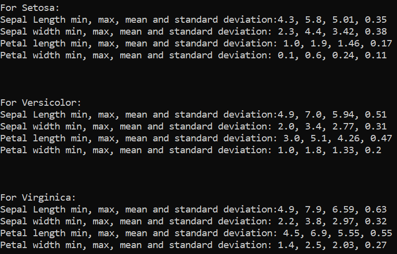

# Iris Flower Dataset

## Brief description:

The iris flower data set (sometimes referred to as Fisher’s Iris data set) was first encountered in 1936 
in a paper titled The use of multiple measurements in taxonomic problems. In it a man by the name 
Ronald Fisher used measurements of the sepal and petal of three different types of iris flowers 
(Setosa, Versicolour and Virginica). There are 150 sets of measurements each containing the width 
and length of both the sepal and petal (fifty times for each). Figure 1 shows how similar the three 
irises are and indicates where the petal and sepal are on the iris plant. [2]

## So who was Ronald Fisher? [3]

Sir Ronald Aylmer Fisher (to give him his full title) was a British Statistician and Geneticist. Born in 
East Finchley in 1890 Fisher started to show a “special ability” when it came to mathematics at an 
early age. He had also from an early age gained a strong biological interest. As a result, he was 
unsure whether to go into mathematics or biology. Choosing mathematics at Cambridge he came 
across a book by Karl Pearson titled Mathematical contributions to the theory of evolution. After this 
he was interested in problems to do with evolution and genetics.

After University he took up work in an investment company and then moved on to working on a 
farm in Canada, no doubt bored with what would have been simple work for a mathematician of his 
ability. He also tried to join the army in 1914 but was rejected due to his terrible eye sight. For the 
next five years he would teach as a mathematics and physics at various public schools. 

He never lost his interest in mathematics and genetics though and through this time he was 
developing his own ideas. These ideas brought on interest and job offers. From here he had more 
freedom and resources to pursue his work eventually leading him to produce The use of multiple 
measurements in taxonomic problems amongst many others. Fisher despite his natural and 
developed abilities clearly pursued knowledge over financial gain which is what led him to be such 
an influential person in statistics and is considered “the single most important figure in 20th century 
statistics”.[1]

## An more in-depth Look at the Data Set:

First off, I think it would help to have a visual representation of the data set. Below is a table 
containing the first 4 rows of the data set and the headings of each column.

The heading of each column (i.e. sepal length, sepal width, petal length etc.) are called attributes. 
You can think of attributes as features each flower has. 

This data set contains 150 rows. This is further split into three. The first 50 are the measurements 
from setosa. The second 50 are from versicolor. The third set of 50 are from virginica.

First by splitting the data up into these three groups and preforming some calculations for minimum 
and maximum values, the mean and the standard deviation we can draw some initial conclusions (see table below).

From this table it’s clear that Setosa over all have the smallest variation in measurements (standard 
deviation or std in table). This gives us an early indication that if we are going to be able to discern 
the sepal measurements for both Versicolor and Virginica are quite close. This may indicate that the 
sepal measurements may be a poor choice for discerning between the two. In fact, across all three 
flowers the Sepal width ranges are quite close. From first glance it’s clear that if we are going to find 
a method of telling these flowers apart most if not all the features will have to be considered. This is 
what makes this data set so popular for testing different sorting algorithms and teaching.

We’ll look at some graphs that compare certain features. The first is the sepal length plotted against the sepal 
width. From this it’s clear to see that the setosa is almost complete separate from the other two only for the
little outlier in the bottom left. So, comparing the sepal length against the sepal width is possibly a good way of
discerning it from the others. This might be done by getting a range of ratios of length and width and seeing if an
unknown one is within that band. If it is there is a high chance it is a setosa. However versicolor and virginica
seem to be scattered together with no possible way of separating the two.

The next graph is petal length plotted against petal width. This shows a distinct separation of setosa from
versicolor and virginica. Those last two have more some cross over but not as much as the sepal graph. 

Setosa has some distinct features and be clearly isolated. The Python code also has a graph that compares width and
length multiplied together for sepal and petal and compared. Although as you can see below it isn’t better for
clearly separating versicolor and virginica. 

This is the reason this is such a popular data set. The next thing some people do is use algorithms.

### K-Nearest Neighbor:

In the Python code I use an algorithm (k-nearest neighbor through module scikit-learn) to find the closest two sets
of measurements. The idea is that you compare the current data set with your new measurements of an unknown iris and
find the closest matches. This would give you a clear idea and a good estimate of what type of iris it is.

To improve the K-Nearest algorithm more testing would have to be done. In this explanation the scikit-learn
k-nearest algorithm uses a distance called Minkowski [4].

For the purpose of this explanation this formula doesn’t need to be broken down too much but it is worth noting that
by default scikit-learn has p=2 (which is known as Euclidean distance), it might be worth testing and comparing
accuracy with different values of p (1 = Manhattan distance). 

### Python File (fisherIrisData):

This part of the documentation explains how to use the python file included. The first thing to do is run the
fisherIrisData.py file from the pand-project folder on the command line like so:

Next the python file will automatically generate the min, max, mean and standard deviation for each list of
measurement for each iris as shown:

And three graphs (as shown in in-dept section) are generated automatically.

It then prompts the user for measurements of an unknown iris.

Filling in these measurements it will use KNN to produce the two nearest matching set of measurements.

Then it will tell you what it matches with most:

## References:
[1] - archive.ics.uci.edu/ml/datasets/Iris
[2] - https://pdfs.semanticscholar.org/6ccd/4303f68f3543fc794c376ce00395947a79b6.pdf
[3] - http://www.comp.tmu.ac.jp/morbier/R/Fisher-1936-Ann._Eugen.pdf
[4] - Albon, C., 2018. Machine Learning with Python Cookbook: Practical Solutions from 
Preprocessing to Deep Learning. 1st ed. 1005 Gravenstein Highway North Sebastopol, CA 95472: O'Reilly Media, 
Incorporated, 2018.
[5] - https://www.kaggle.com/lalitharajesh/iris-dataset-exploratory-data-analysis